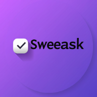

# Sweeask — TaskTracker Pro

<div align="center">



**Free. Private. For Everyone.**

A high-performance, offline-first productivity dashboard.  
No login. No subscription. No data collection. Just open and go.

[](https://sanjaysainisxe-spec.github.io/sweeask/)
[](https://github.com/sanjaysainisxe-spec/sweeask/releases)
[](LICENSE)
[](https://sanjaysainisxe-spec.github.io/sweeask/app.html)

</div>

---

## What is Sweeask?

Sweeask is not just a to-do list. It is a **personal operating system for focus, achievement, and data sovereignty** — built on four pillars:

| Pillar | Description |
|--------|-------------|
| 🔐 **Privacy by Design** | All data stored locally. No servers. No accounts. No tracking. |
| 🌐 **Universal Accessibility** | Works on every browser, every device. Free forever. |
| 📊 **Visual Intelligence** | Heatmaps, charts, streaks — data turned into motivation. |
| 🔧 **Democratization** | Enterprise-grade tools with zero price tag. |

---

## Features

### Core Task Engine
- ✅ Add tasks with title, notes, type, priority, status, time range
- 🔁 **Recurring tasks** — Daily, Weekday-only, Weekly, Monthly (auto-appear every day)
- ⏰ **Time ranges** — Set 3pm–5pm; Today view groups tasks by Morning/Afternoon/Evening/Night
- 📋 5 task types: Task, Event, Meeting, Deadline, Habit
- 🎨 4 priorities: Low, Medium, High, Critical
- 🏷️ Custom tags, estimated minutes, status tracking

### Views (16 total)
| View | Description |
|------|-------------|
| 📅 Today | Tasks for today grouped by time of day |
| 📋 All Tasks | Every task, grouped by date with progress bars |
| 🔁 Recurring | All recurring tasks grouped by frequency |
| 📆 This Week | 7-day grid with clickable task cards |
| 🗓️ Monthly Grid | Table of every day in the month |
| 📅 Calendar | Visual monthly calendar with task dots |
| 📊 Analytics | 6 chart types — rings, bars, lines, pies |
| 🟩 Heatmap | 112-day GitHub-style activity grid |
| ⏱️ Focus Timer | Pomodoro with 25m/5m/15m cycles |
| + 7 more | Events, Meetings, Deadlines, Habits, Priority filters |

### Platform Support
| Platform | Status |
|----------|--------|
| 🌐 Web Browser | ✅ Live now |
| 📱 Mobile PWA (Android/iOS) | ✅ Install via browser |
| 🖥️ Desktop PWA (Windows/Mac/Linux) | ✅ Install via Chrome/Edge |
| 📦 Offline HTML File | ✅ [Download](https://sanjaysainisxe-spec.github.io/sweeask/TaskTracker-Pro-v3.html) |

### Other Features
- 🔈 Web Audio API — sound on add, complete, delete, timer
- 🔔 Browser Notification API — notifications for task completion and timer
- 🌌 3 Themes — Default Purple, Dark, Charcoal, Light
- 📥 Export to CSV and JSON
- 🔥 Streak counter
- 🔍 Search across all tasks
- ⌨️ Keyboard shortcuts: `Ctrl+N` add, `Ctrl+K` search, `Esc` close
- 📴 100% offline — works on a plane, no internet needed

---

## Tech Stack

```
HTML5 + CSS3 + Vanilla JavaScript (ES5)
Chart.js 4.4.1          — Charts and visualizations
Web Audio API           — Sound effects
Web Notifications API   — Browser notifications  
localStorage            — Data persistence (no backend)
Service Worker          — Offline caching (PWA)
Web App Manifest        — Installable PWA
Inter + Outfit (Google Fonts) — Typography
```

**Zero framework. Zero build step. Zero dependencies beyond Chart.js.**  
Open the HTML file and it works.

---

## File Structure

```
sweeask/
├── index.html          # Landing page
├── app.html            # Full task tracker app
├── about.html          # Vision & philosophy
├── support.html        # Donate / contribute
├── updates.html        # Changelog / releases
├── 404.html            # 404 error page
├── style.css           # Global styles + 3 themes
├── components.js       # Shared JS utilities (PWA, themes, SW)
├── sw.js               # Service Worker (offline caching)
├── manifest.json       # PWA Web App Manifest
├── favicon.png         # 32x32 favicon
├── pwa-192x192.png     # PWA icon (192x192)
└── pwa-512x512.png     # PWA icon (512x512)
```

---

## Getting Started

### Option 1 — Open in browser (instant)
```
https://sanjaysainisxe-spec.github.io/sweeask/app.html
```

### Option 2 — Install as PWA
1. Open the link above in Chrome or Edge
2. Click the **⬇ Install** button in the address bar (or use the install button on the site)
3. Sweeask opens like a native app — works offline permanently

### Option 3 — Download offline file
Download [`TaskTracker-Pro-v3.html`](https://sanjaysainisxe-spec.github.io/sweeask/TaskTracker-Pro-v3.html) and double-click it. Works with zero internet, forever.

### Option 4 — Run locally
```bash
git clone https://github.com/sanjaysainisxe-spec/sweeask.git
cd sweeask

# Option A: Python
python -m http.server 8080

# Option B: Node.js
npx serve .

# Option C: VS Code
# Install "Live Server" extension → Right-click index.html → Open with Live Server
```
Then open `http://localhost:8080`

---

## Deployment (GitHub Pages)

### Automatic (recommended)
This repo includes a GitHub Actions workflow that auto-deploys on every push to `main`.

1. Go to your repo → **Settings → Pages**
2. Set **Source** to `GitHub Actions`
3. Push any commit — your site deploys automatically to:
   ```
   https://sanjaysainisxe-spec.github.io/sweeask/
   ```

### Manual
1. Go to **Settings → Pages**
2. Source: **Deploy from a branch**
3. Branch: `main` / `/(root)`
4. Click Save

---

## Roadmap

| Version | Status | Features |
|---------|--------|----------|
| v1.0.0 | ✅ Shipped | Core task tracker, charts, priorities |
| v1.1.0 | ✅ Shipped | Recurring tasks, time ranges, weekly grid |
| v1.2.0 | 🔄 In Progress | Website, PWA, themes, changelog |
| v1.3.0 | 📋 Planned | Command palette (Ctrl+K), subtasks |
| v1.4.0 | 🔮 Future | Local AI "Jimmy" via Transformers.js |
| v2.0.0 | 🔮 Future | P2P sync via WebRTC + Yjs CRDTs |

---

## Contributing

Contributions are welcome! Here's how:

1. **⭐ Star the repo** — It's free and helps others discover the project
2. **🐛 Report bugs** — Open an issue with browser, OS, and steps to reproduce
3. **💡 Suggest features** — Start a GitHub Discussion
4. **🔀 Submit PRs** — Fork, make changes, open a pull request

### Development Notes
- No build step required — edit files directly
- Test in multiple browsers (Chrome, Firefox, Safari)
- All JS is ES5-compatible for maximum browser support
- CSS uses custom properties — add a new theme by adding a `[data-theme="yourtheme"]` block to `style.css`

---

## Privacy

Sweeask collects **zero data**.

- ✅ No analytics
- ✅ No error tracking
- ✅ No cookies
- ✅ No user accounts
- ✅ No cloud sync
- ✅ No ads

All task data is stored in your browser's `localStorage`. It never leaves your device. We have no servers to be breached.

---

## License

MIT License — free to use, modify, and distribute.

```
Copyright (c) 2026 Sweeask

Permission is hereby granted, free of charge, to any person obtaining a copy
of this software and associated documentation files (the "Software"), to deal
in the Software without restriction, including without limitation the rights
to use, copy, modify, merge, publish, distribute, sublicense, and/or sell
copies of the Software, and to permit persons to whom the Software is
furnished to do so, subject to the following conditions:

The above copyright notice and this permission notice shall be included in all
copies or substantial portions of the Software.
```

---

## Support the Project

Sweeask is free forever. But development takes time.

- ⭐ **Star this repo** (free, takes 5 seconds, most impactful)
- ☕ **[Buy us a coffee](https://www.buymeacoffee.com/)** (covers domain/hosting)
- 🐛 **[Report a bug](https://github.com/sanjaysainisxe-spec/sweeask/issues)** (saves hours of debugging)
- 📢 **Share with a friend** (grows the community)

---

<div align="center">

**Built with ❤️ for the community. Free forever.**

[Live Site](https://sanjaysainisxe-spec.github.io/sweeask/) · [Open App](https://sanjaysainisxe-spec.github.io/sweeask/app.html) · [Report Bug](https://github.com/sanjaysainisxe-spec/sweeask/issues) · [Request Feature](https://github.com/sanjaysainisxe-spec/sweeask/discussions)

</div>
